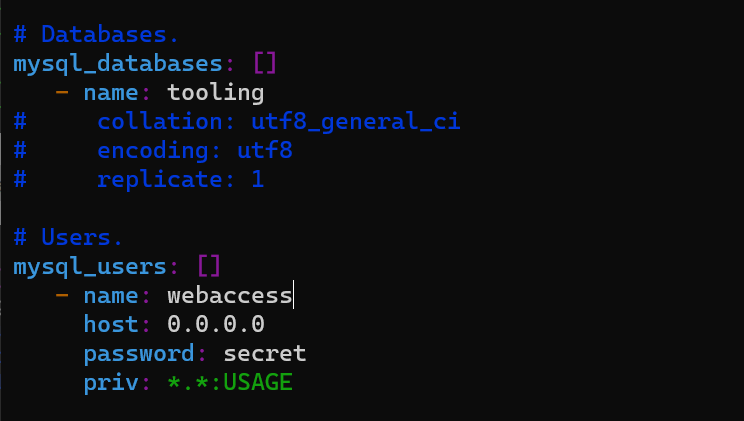

### **INTRODUCING DYNAMIC ASSIGNMENT INTO OUR STRUCTURE** ###

In your https://github.com/<your-name>/ansible-config-mgt GitHub repository start a new branch and call it dynamic-assignments.


Create a new folder, name it dynamic-assignments. Then inside this folder, create a new file and name it env-vars.yml. 


Create a new folder env-vars, then for each environment, create new YAML files which we will use to set variables.


Now paste the instruction below into the env-vars.yml file.
```
---
- name: collate variables from env specific file, if it exists
  hosts: all
  tasks:
    - name: looping through list of available files
      include_vars: "{{ item }}"
      with_first_found:
        - files:
            - dev.yml
            - stage.yml
            - prod.yml
            - uat.yml
          paths:
            - "{{ playbook_dir }}/../env-vars"
      tags:
        - always
```


## **Update site.yml with dynamic assignments** ##

Update site.yml file to make use of the dynamic assignment.

```
---
- hosts: all
- name: Include dynamic variables 
  tasks:
  import_playbook: ../static-assignments/common.yml 
  include: ../dynamic-assignments/env-vars.yml
  tags:
    - always

-  hosts: webservers
- name: Webserver assignment
  import_playbook: ../static-assignments/webservers.yml
  ```
  

  ## **Community Roles** ##

  Create a role for MySQL database – it should install the MySQL package, create a database and configure users.

  >With Ansible galaxy, let's use a ready made role that is production ready, and dynamic to accomodate most of linux flavours

  ## *Download Mysql Ansible role* ##

  We will be using a [MySQL role developed by geerlingguy.](https://galaxy.ansible.com/geerlingguy/mysql)

  >Webhook and Jenkins jobs are no longer needed to update your codes on Jenkins-Ansible server, so we can disable it – we will be using Jenkins later for a better purpose.

  On Jenkins-Ansible server make sure that git is installed with 
  ```
  git --version
  ```
  

  Then go to‘ansible-config-mgt’ directory and run

  ```
git init
git pull https://github.com/<your-name>/ansible-config-mgt.git
git remote add origin https://github.com/<your-name>/ansible-config-mgt.git
git branch roles-feature
git switch roles-feature
```


Inside roles directory create your new MySQL role with ansible-galaxy install geerlingguy.mysql and rename the folder to mysql
```
# make a new directory called "roles" and cd into it 
mkdir roles && cd roles

# Create MySQL roles with ansible-galaxy

ansible-galaxy install geerlingguy.mysql

# rename the folder to mysql
mv geerlingguy.mysql/ mysql
```


Read README.md file, and edit roles configuration to use correct credentials for MySQL required for the tooling website.

In the default folder of the MySql parent directory, edit the main.yml file.


Uncomment and update authentication details in the file. Save abnd exit.


Upload the changes into your GitHub:
```
git add .
git commit -m "Commit new role files into GitHub"
git push --set-upstream origin roles-feature
```


Create a Pull Request and merge it to main branch on GitHub.


## *LOAD BALANCER ROLES* ##

We want to be able to choose which Load Balancer to use, Nginx or Apache, so we need to have two roles respectively:

1. Nginx
2. Apache

I will use these 2 roles created by geerlingguy in ansible galaxy 

[Apache Load balancer](https://galaxy.ansible.com/geerlingguy/apache)


[Nginx Load balancer](https://galaxy.ansible.com/geerlingguy/nginx)


For both Nginx's and Apache's defaults/main.yml files, add a control variable as well as the webserver ip's enable_apache_lb: false and load_balancer_is_required: false

For Apache role I updated the  defaults/main.yml


For Nginx role I updated defaults/main.yml


Update both assignment and site.yml files respectively

loadbalancers.yml file

```
- hosts: lb
  roles:
    - { role: nginx, when: enable_nginx_lb and load_balancer_is_required }
    - { role: apache, when: enable_apache_lb and load_balancer_is_required }
```


site.yml file

```
- name: Loadbalancers assignment
       hosts: lb
         - import_playbook: ../static-assignments/loadbalancers.yml
        when: load_balancer_is_required 
```


Finally for this concurrent setup, let's add the control logic in dev.yml since with_first_found  from the dynamic-assignment/env-vars.yml file we included above will process the first file found. This means, it will find dev.yml first.


In env-vars/dev.yml


> With enable_apache_lb and load_balancer_is_required set to true - This means apache load balancer would be configured and if nginx is true, nginx would be configured.

>Make sure to open required ports - 80 and 3306

It's time to run the playbook


Check if Apache is running on the webservers


To view the tooling website on the browser
http://54.163.205.10/index.php


